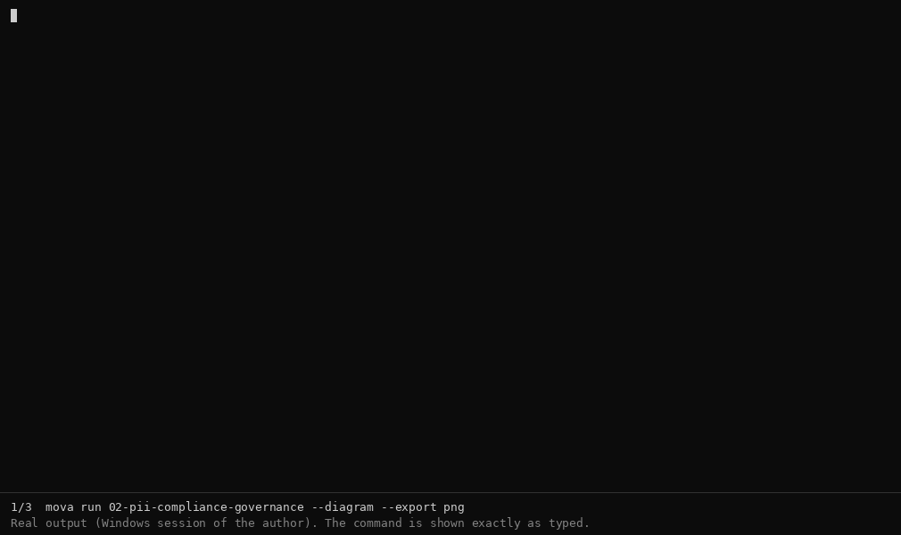

# mova — soberanía del contexto antes de la inferencia

> **Tú decides qué contexto puede llegar a la IA. mova deja evidencia de esa decisión.**
> *You decide what context may reach the AI. mova leaves evidence of that decision.*

[Español](README.md) · [English](../en/README.md) · [Volver a la raíz](../../../README.md)

| Tú decides | Tú bloqueas | Tú compruebas |
|---|---|---|
| **Qué entra:** `focus`/`exclude` (AST: funciones, no archivos enteros), tarea | **Qué no debe salir:** enmascarado PII (opt-in), tope de tokens (`max_tokens`), `dry_run` | **Qué recibió el modelo:** `context-report.md`, `pii-audit-log.json`, `egress_sanitized.md`, diagrama |

`mova` es un binario local que corre **antes** de la llamada al modelo (CLI · `mova chat` · MCP · HTTP). Funciona con Claude Code, Cursor, Windsurf, Ollama y cualquier cliente MCP.

**Alcance honesto:** «tú decides» aplica al contexto que pasa **a través de mova**. No puede ver lo que un IDE o agente envíe por su cuenta, y el enmascarado PII es heurístico: evidencia y mitigación, no garantía de cumplimiento. No es un gateway, un IDE, un RAG ni una plataforma.

## Pruébalo (lo que muestra el GIF — todo salida real)

```bash
# 1) Contexto gobernado, ahorro de tokens, PII e imagen de evidencia (sin API key, sin llamar a un modelo)
mova run 02-pii-compliance-governance --diagram --export png
#    → 02-pii-compliance-governance.png   (20.014 tok antes → 7.153 tok después; 171 de 1.694 tokens pseudonimizados)

# 2) Audita CUALQUIER repo antes de enviarlo a una IA — no se envía nada (en scripts añade "< /dev/null": pregunta [Y/n] al final)
mova context-trace --repo https://github.com/fastapi/fastapi --export pdf \
  --task "solve_dependencies get_dependant in fastapi/dependencies/utils.py" --prune-docstrings \
  --ignore "docs/**, tests/**, *.lock, docs_src/**, .github/**, docs/en/**"
#    → context-report.pdf · context-diagram.png · pii-audit-log.json

# 3) Grafos de dependencias + registro de egreso sanitizado, sin llamar a un LLM (el ejemplo 04 tiene "memory": true y "dry_run": false)
mova run 04-nebula-delivery analizar-trazabilidad
mova run 04-nebula-delivery agregar-columnas
#    → analizar.png · agregar-columnas.png · egress_sanitized.md   (memory.md lo escribe `mova chat` / `save_memory`)
```

Instalar: `make install` (requiere Go ≥ 1.24) o doble clic en `installers/<tu SO>/…`. Desinstalar: [`uninstallers/`](../../../uninstallers/README.md). Los costos mostrados son estimaciones teóricas de tokens de entrada (`config/prices.json`).

## Úsalo con Claude Code
`claude mcp add --transport stdio --scope project --env MOVA_PROJECT_ROOT=<ruta de mova> mova-context -- mova mcp start --stdio` → [guía completa, límites y permisos](../es/MCP_INTEGRATION.md). Claude Code sigue siendo el modelo; mova gobierna el contexto que pide.

## Dónde se ha verificado
Windows: sesiones del autor (pasos 1–2 del GIF). Linux amd64: compilación, 21 paquetes de tests, MCP stdio y ejemplo 08 (ver [VERIFICATION](../../VERIFICATION.md)). macOS y Linux arm64: compilados, **no ejecutados**.

## Matriz de Auditoría Pre-Inferencia

| # | Pregunta de Seguridad / CISO | Cómo responde `mova` | Evidencia / Artefacto |
|---|---|---|---|
| 1 | ¿Qué información llegó al modelo? | Inventario exacto de archivos y símbolos AST seleccionados | `context-report.md`/`.pdf` |
| 2 | ¿Por qué llegó? | Relevancia por tarea + reglas `focus`/`exclude` (incl. AST) | `context-trace` |
| 3 | ¿Qué política/autoridad permitió esta salida? | `PolicyAuthor` — jerarquía `project.json` → `config/policy.json` → `MOVA_POLICY_AUTHOR` → `system:default` | `project.json` / reportes |
| 4 | ¿Qué política aplicó? | Reglas de inclusión/exclusión del escaneo | `config/policy.json` |
| 5 | ¿Tenía PII o secretos? | Detección heurística de patrones sensibles | `pii-audit-log.json` |
| 6 | ¿Se sanitizó? | Sanitizer + PII Masking (opt-in) vs paso sin cambios | Diagrama · `mova-budget-report.md` |
| 7 | ¿Cuántos tokens fueron? | Medición con tokenizer real (`cl100k_base`) | `context-report.md` |
| 8 | ¿Cuánto costó? | Estimación por proveedor antes del envío | `mova budget` |
| 9 | ¿Qué commit se analizó? | Estado exacto del repo en el momento de auditar | `context-report.md` (Execution ID + commit) |
| 10 | ¿Qué agente lo pidió? | `AgentClient` — `mova-cli`, o el cliente MCP real capturado en `initialize` | Reportes / diagrama |
| 11 | ¿Qué modelo lo recibió? | `TargetModel` — `<provider>/<config>` de `llm_profile` | Reportes / diagrama |

## Arquitectura

```
[ Agente / IDE (Claude Code, Cursor, MCP) ]
                   │
                   ▼  Solicitud de contexto
┌───────────────────────────────────────────────────┐
│     MOVA — MOTOR DE GOBERNANZA PRE-INFERENCIA      │
│  Focus/Exclude (AST) · Sanitizer · PII Masking     │
│  Circuit Breaker de presupuesto · Diagrama PNG/PDF │
└───────────────────────────────────────────────────┘
                   │
                   ▼  Contexto auditable, con evidencia
        [ LLM destino (Anthropic, Ollama, etc.) ]
```

Un motor, cuatro puertas — CLI, `mova chat`, MCP (stdio/HTTP), HTTP REST — todas llaman a la misma función.

## Ejemplos (1 clic, 15 segundos)

| Ejemplo | Qué demuestra |
|---|---|
| `examples/01-mcp-agent-governance` | Un agente MCP pide contexto; Mova decide y deja evidencia |
| `examples/02-pii-compliance-governance` | PII/secretos, enmascarado, política aplicada (escenario Ley 21.719) |
| `examples/03-tokenomics-context-trace` | `focus`/`exclude` (AST)/`task`, presupuesto, Context Trace |
| `examples/04-output-mova-trace-fastApi` | Validación de `mova context-trace` sobre el repositorio remoto de FastAPI. Demuestra el filtrado preciso por `focus`/`exclude` mediante parsing de AST, control de presupuesto de tokens y trazabilidad de contexto en proyectos de código real. |
| `examples/05-test-mcp-cursor` | Validación del aislamiento Air-Gap y gobernanza de egresos sobre el proyecto `02-pii-compliance-governance`. Demuestra la interceptación de `chat_completion` bajo `dry_run: true`, sanitización de PII y evidencia de auditoría consumida desde un cliente MCP.|
| `examples/06-nebula-delivery-graph-memory` | Dos tareas encadenadas (analizar → agregar columnas) con memoria, grafo AST y egress auditado (proyecto `04-nebula-delivery`) |
| `examples/07-nebula-multiagente-flota` | Grupo de 3 agentes con memoria compartida (proyecto `05-nebula-flota`) |
| `examples/08-nebula-release-gate` | Multiagente sin LLM propio: un agente anfitrión orquesta vía MCP/HTTP con `run_agent` + `save_memory` |

## Límites honestos del "Air-Gap" (`dry_run`) — en 15 segundos

Con `egress_audit.dry_run: true`, Mova garantiza SU parte: nunca envía el contexto real a ningún
proveedor, y siempre deja evidencia en disco. Lo que Mova **no puede garantizar** es que el **modelo
anfitrión** (Cursor, Claude Code, Grok, etc. — quien invoca la herramienta MCP) obedezca la directiva
de seguridad que viene con el bloqueo: un anfitrión insistente puede intentar leer otros archivos
locales (`context-report.md`, `project.json`, memoria, etc.) para "reconstruir" el contexto por su
cuenta — esto ya ocurrió en pruebas reales. Mova refuerza el mensaje bloqueado con una directiva
explícita anti-elusión (ver `GOVERNANCE_CONTROLS.md § dry_run`), pero el cumplimiento final de esa
directiva depende del anfitrión, no de Mova — Mova no controla, ni puede controlar, qué hace un
proceso externo con el texto que recibe. No se ofrece esto como una garantía absoluta porque no lo es.

## Documentación

- [`docs/i18n/es/COMMANDS.md`](../es/COMMANDS.md) — comandos (estilo MAN page)
- [`docs/i18n/es/PROJECT_JSON.md`](../es/PROJECT_JSON.md) — referencia de `project.json`
- [`docs/i18n/es/AST_FILTER.md`](../es/AST_FILTER.md) — sintaxis `archivo::kind=nombre`
- [`docs/i18n/es/CONTEXT-TRACE.md`](../es/CONTEXT-TRACE.md) — cómo se toma la decisión de contexto
- [`docs/i18n/es/ARTIFACTS.md`](../es/ARTIFACTS.md) — qué es cada archivo que Mova genera
- [`docs/i18n/es/GOVERNANCE_CONTROLS.md`](../es/GOVERNANCE_CONTROLS.md) — `debug`, `policies`, `on_exceed`, `dry_run`: qué corta el proceso y qué solo explica
- [`docs/i18n/es/MCP_INTEGRATION.md`](../es/MCP_INTEGRATION.md) — **usar mova con Claude Code** (MCP, permisos, límites)
- [`docs/i18n/es/POSITIONING.md`](../es/POSITIONING.md) — qué es mova y qué no es
- [`docs/VERIFICATION.md`](../../VERIFICATION.md) — qué se ejecutó realmente y dónde
- [`uninstallers/`](../../../uninstallers/README.md) — quitar mova (binario, PATH, `MOVA_PROJECT_ROOT`) sin dejar rastros
- [`docs/i18n/es/FUNCTIONS.md`](../es/FUNCTIONS.md) — todas las funciones y argumentos, por canal (MCP · HTTP · Chat/CLI)
- [`docs/i18n/es/SOURCE.md`](../es/SOURCE.md) — referencia técnica de arquitectura
- [`docs/i18n/es/FAQ.md`](../es/FAQ.md)

**Nota técnica:** el enmascarado de PII es una mitigación heurística, no una garantía de cumplimiento legal.
