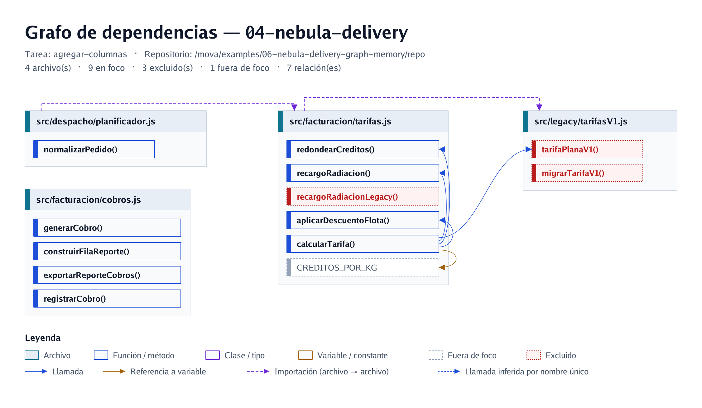

# Ejemplo 06 — Nebula Delivery: grafo AST + memoria entre tareas + egress auditado

> Proyecto **100 % ficticio** (cápsulas de reparto a la estación lunar Selene), escrito en JavaScript, para ver en 2 minutos tres cosas que Mova hace juntas: **dibuja el grafo de funciones sin gastar tokens**, **deja que una tarea parta de lo que concluyó la anterior** (`memory`) y **audita lo que sale hacia el LLM** (`egress_audit`).

| Qué demuestra | Dónde se ve |
|---|---|
| Grafo de dependencias por tarea, sin LLM | `projects/04-nebula-delivery/analizar.png` y `agregar-columnas.png` |
| `exclude` por archivo **y** por función dentro de un archivo que sí se usa | rojo punteado en los grafos (`tarifasV1.js`, `recargoRadiacionLegacy`, `depurarTrazaPlanificador`) |
| `memory: true`: la tarea 2 lee la síntesis de la tarea 1 | `projects/04-nebula-delivery/memory.md` |
| `egress_audit`: evidencia sanitizada de lo enviado, sin duplicados | `projects/04-nebula-delivery/egress_sanitized.md` |
| Agents/skills/prompts propios (`paths`) coherentes con las variables del JSON | `capabilities/` |

## La historia (ficticia)

El reporte de cobros de Nebula Delivery muestra la hora de llegada **programada** (`etaProgramada`) aunque la telemetría ya midió la **real** (`etaReal`). Regla de negocio: en el valor final del reporte se usa `etaReal` si existe; si no, `etaProgramada`. Dos tareas, en orden:

1. **`analizar-trazabilidad`** — ¿en qué función se pierde `etaReal`? (no modifica nada)
2. **`agregar-columnas`** — agrega *Llegada real* / *Llegada programada* al CSV, **partiendo del hallazgo de la tarea 1**.

## Estructura

```
examples/06-nebula-delivery-graph-memory/
├── repo/                          ← el código ficticio que Mova analiza
│   ├── src/despacho/{planificador,rutas}.js
│   ├── src/facturacion/{tarifas,cobros,notificaciones}.js
│   ├── src/telemetria/sensores.js
│   ├── src/legacy/tarifasV1.js    ← excluido
│   └── datos/pedidos-demo.json
└── capabilities/{agents,skills,prompts}/   ← agent, skill y 2 prompts de este ejemplo
projects/04-nebula-delivery/
├── project.json                   ← 2 tareas, memory: true, egress_audit, graph por tarea
├── analizar.png · agregar-columnas.png
├── memory.md · egress_sanitized.md
config/models/ollama/nebula-demo.json   ← num_ctx 16384 y max_tokens 2048
```

## Cómo ejecutarlo (desde la raíz de Mova)

```bash
ollama pull llama3.2:3b                       # o apunta llm_profile a otro modelo

# 1) Sin LLM: arma el contexto, genera los 2 grafos y el egress
mova run 04-nebula-delivery analizar-trazabilidad
mova run 04-nebula-delivery agregar-columnas

# 2) Tarea 1 en un chat → al terminar deja su síntesis en memory.md
mova chat 04-nebula-delivery analizar-trazabilidad
> revisar            # verás: [Memory] 1 entrada(s) guardada(s) ... (tarea: analizar-trazabilidad)
> exit

# 3) Tarea 2 en OTRO chat (otro proceso): recibe esa síntesis en la sección MEMORY
mova chat 04-nebula-delivery agregar-columnas
```

También sin salir del chat: `mova chat 04-nebula-delivery` (sin tarea = **todas**) y luego `/tasks`, `/task agregar-columnas`, `/run agregar-columnas`. Por MCP/HTTP, la misma memoria aplica a `chat_completion` con `project: "04-nebula-delivery"` y `task`.

## Qué verás

**Grafo de la tarea 2** — azul = en foco, gris punteado = fuera de foco, **rojo punteado = excluido**; `calcularTarifa → tarifaPlanaV1` aparece aunque `tarifasV1.js` esté excluido:



**`memory.md`** — por entrada: fecha, tarea y el bloque de síntesis (hallazgos `archivo::función`, datos clave, decisiones, pendiente). Una síntesis idéntica no se vuelve a escribir.

**`egress_sanitized.md`** — un bloque por pieza del contexto (cada agent/skill/prompt, cada `FOCUS`, la `MEMORY`). Igual → se omite; cambiado → se reemplaza; nuevo → se anexa. En el chat 2 verás aquí que la `MEMORY` con el hallazgo de la tarea 1 **sí salió** hacia el modelo.

## Por qué sirve el grafo

- **Cero tokens:** se dibuja con el mismo Tree-Sitter del filtro AST, sin llamar al modelo.
- **Verifica tu `focus`/`exclude` antes de gastar:** ves qué entra, qué queda fuera de foco y qué excluiste (y qué excluido sigue siendo llamado).
- **Una imagen por tarea**, regenerada solo si cambia el código o el JSON (`graph-cache.json`).

## Notas honestas

- Los archivos `memory.md`, `egress_sanitized.md` y los PNG de muestra se generaron ejecutando el binario real de Mova; las **respuestas del modelo fueron simuladas** (coherentes con el código) para que el ejemplo sea reproducible sin GPU. Con tu modelo local la redacción cambiará.
- `mova chat` genera el grafo en segundo plano y **no espera al salir**: usa `mova run` primero (como arriba) o espera el aviso `[Graph] … grafo generado`.
- Con `egress_audit.dry_run: true` Mova audita y mide pero **no llama al modelo** (y por tanto no registra memoria).
- Este ejemplo es para modelos con ventana ≥ 8k: ajusta `num_ctx` en `nebula-demo.json` si usas otro.
